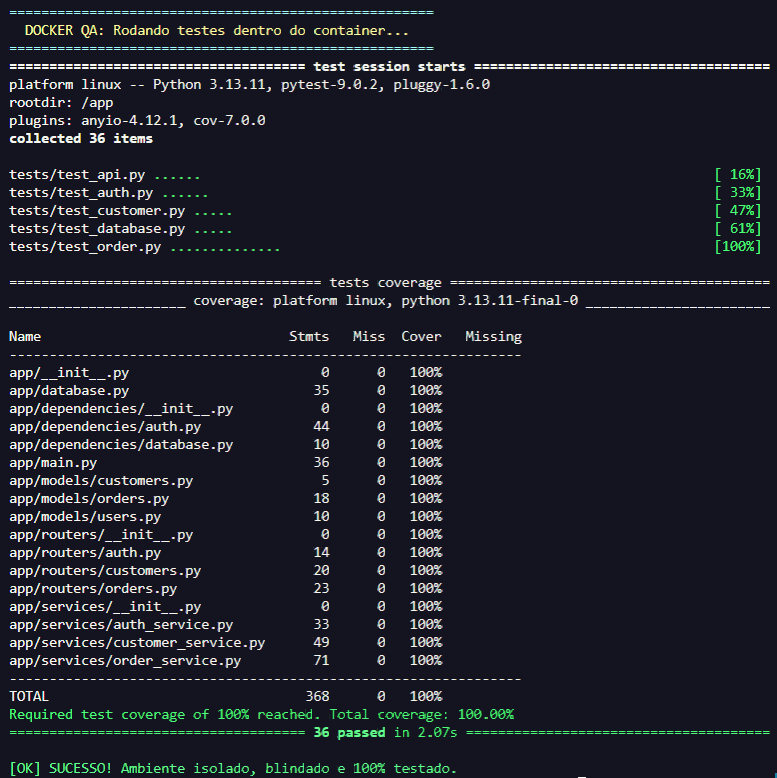
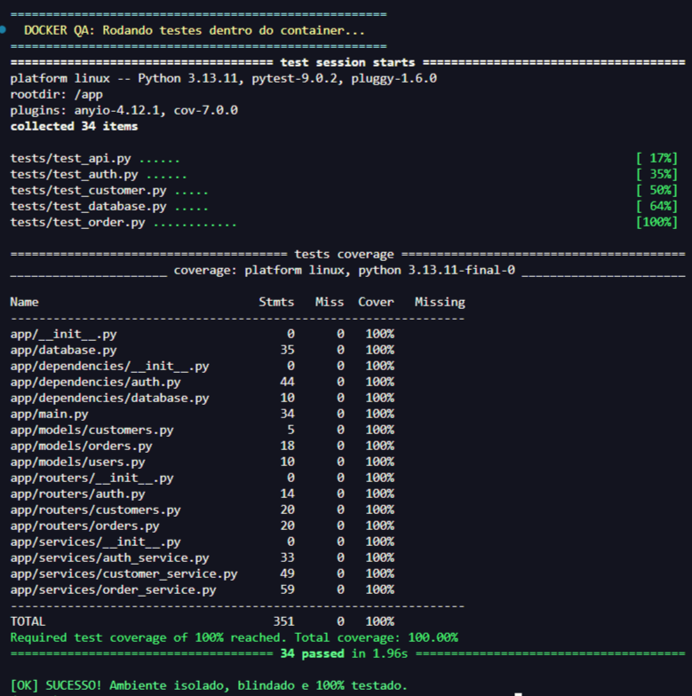

## Diário de Desenvolvimento

**[23/01/2026] - Engenharia de Resiliência, Tratamento de Exceções e Interação com o SO**

Nesta sessão, aprofundei a robustez do **Projeto layered-architecture-api** no ecossistema Java. O foco migrou da sintaxe básica para a construção de um sistema "à prova de falhas", integrando a lógica de negócios com a gestão de erros e a manipulação direta de processos do sistema operacional.

### 1. Controle de Fluxo e Loops Aninhados (Nested Loops)

Aperfeiçoei a lógica de entrada de dados implementando uma estrutura de validação por camadas. Entendi que, em sistemas críticos, o programa não deve apenas detectar um erro, mas sim impedir o avanço do estado até que a integridade seja garantida.

- **Estratégia de Validação**: Utilizei um laço ``while`` aninhado dentro de um ``for``. Enquanto o ``for`` gerencia a iteração sobre os índices do array (vagas do pátio), o ``while`` atua como um "porteiro" lógico, retendo o fluxo de execução até que o input satisfaça os critérios de segurança (pesos entre 2.000kg e 10.000kg).

- **Uso de Flags**: Implementei variáveis booleanas (``trava``) para controle de estado, garantindo uma saída limpa do loop apenas após a validação completa.

### 2. Resiliência via Tratamento de Exceções (Exception Handling)
Diferente de linguagens de tipagem dinâmica, o Java exige uma postura proativa diante de falhas. Aprendi a implementar "escudos" no código:

- **InputMismatchException**: Dominei o uso do bloco ``try-catch`` para capturar erros de tipagem. Se o sistema espera um ``double`` e recebe uma ``String``, o programa agora trata o erro em tempo de execução em vez de encerrar abruptamente (crash).

- **Buffer Management**: Descobri a importância vital de limpar o buffer do ``Scanner``. Ao capturar uma exceção, o dado inválido permanece no "cano" de entrada; utilizei o método ``leitor.next()`` para descartar esse resíduo, evitando loops infinitos e garantindo que a próxima tentativa de leitura seja limpa.

### 3. Abstração de Sistema Operacional e Processos

Elevei o nível de interação do programa com o ambiente externo, saindo da "bolha" da JVM para o terminal real:

- **ProcessBuilder**: Substituí o antigo ``Runtime.exec`` pela moderna classe ``ProcessBuilder``. Compreendi como configurar comandos nativos do SO, herdando a I/O do processo pai (``inheritIO``) e garantindo a sincronização através do método ``.waitFor()``, que pausa a execução do Java até que o comando do sistema (como a limpeza de tela) seja concluído.

- **Portabilidade**: Apliquei ``System.getProperty("os.name")`` para criar um código agnóstico ao sistema, capaz de diferenciar comandos entre Windows (``cls``) e sistemas Unix/Linux (``clear``).

### 4. Modularização e Refatoração Profissional

Apliquei o princípio da **Responsabilidade Única (SRP)** para melhorar a legibilidade do main:

- **Extração de Métodos Estáticos**: Isolei a lógica complexa de interação com o SO no método ``limparConsole()``, permitindo que a lógica de negócio principal permaneça limpa e focada.

- **Otimização Aritmética**: Refatorei métodos de processamento de dados para retornos diretos, reduzindo o uso de variáveis temporárias e otimizando a pilha de execução.

### Exemplo de Código Consolidado**

````
public static void limparConsole() {
    try {
        if (System.getProperty("os.name").contains("Windows")) {
            new ProcessBuilder("cmd", "/c", "cls").inheritIO().start().waitFor();
        } else {
            new ProcessBuilder("clear").inheritIO().start().waitFor();
        }
    } catch (Exception e) {
        System.out.println("Erro ao limpar console.");
    }
}

public static void main(String[] args) {
    while (!trava) {
        try {
            System.out.print("Qual o peso do caminhão? ");
            double valor = leitor.nextDouble();
            if (valor >= 2000 && valor <= 10000) {
                pesos[i] = valor;
                trava = true;
            } else {
                limparConsole();
                System.out.println("Valor fora da faixa!");
            }
        } catch (InputMismatchException e) {
            limparConsole();
            System.out.println("Erro: Digite apenas números.");
            leitor.next(); // Limpeza de buffer
        }
    }
}
````

### Checkpoint de Evolução:

[x] Implementar loops aninhados para validação persistente.
[x] Dominar o bloco ``try-catch`` para capturar InputMismatchException.
[x] Gerenciar o buffer do ``Scanner`` para evitar erros de fluxo.
[x] Executar processos externos sincronizados via ``ProcessBuilder``.
[x] Isolar lógica utilitária em métodos estáticos (``limparConsole``).

**Próximo Passo**: Explorar a coleção dinâmica ArrayList para superar a limitação de tamanho fixo dos arrays convencionais.


## Diário de Desenvolvimento

**[22/01/2026] - Engenharia de Frontend, Escopo de Memória e Paradigmas Funcionais**

Nesta etapa, dei os primeiros passos fundamentais na integração do ecossistema do **Projeto layered-architecture-api** com interfaces web modernas. O objetivo central foi entender como o navegador processa a lógica de comportamento e como organizar um projeto que escala do servidor para a tela do usuário.

### Arquitetura e Estruturação Web

A base foi estabelecida com a criação de um boilerplate **HTML5 semântico**, priorizando a organização profissional de diretórios. Ao separar a lógica em uma pasta ``scripts/``, apliquei o princípio de separação de responsabilidades. Um ponto crítico de aprendizado foi o uso do atributo ``defer`` na integração dos scripts externos. Compreendi que o carregamento assíncrono é vital para a performance, garantindo que o JavaScript não bloqueie a renderização do DOM (Document Object Model), permitindo uma experiência de usuário fluida.

### Gestão de Memória e Escopo (var, let, const)

Aprofundei-me na mecânica interna do JavaScript, explorando como a linguagem gerencia variáveis. Através de testes práticos, analisei o comportamento de:

- **``var``**: Entendi o conceito de hoisting e como seu escopo de função pode causar "vazamentos" de dados para fora de blocos lógicos como ``if``.

**``let e const``**: Adotei o padrão moderno de escopo de bloco, essencial para evitar bugs de colisão de nomes e garantir que a memória seja liberada corretamente. O uso de ``const`` tornou-se minha regra para imutabilidade, aumentando a segurança do código.

### Paradigma Funcional e Sintaxe Moderna (ES6+)

A evolução das funções foi o ponto alto deste estudo. Saí das funções regulares para explorar o dinamismo do JavaScript:

- **Funções Anônimas e Expressões**: Entendi como tratar funções como "cidadãos de primeira classe", podendo atribuí-las a variáveis.

- **IIFE (Immediately Invoked Function Expressions)**: Apliquei o padrão de execução imediata para isolar escopos, uma técnica clássica para evitar poluição do objeto global ``window``.

- **Arrow Functions & Callbacks**: Dominei a sintaxe de flecha (``=>``), percebendo sua elegância em retornos implícitos e sua praticidade ao serem usadas como callbacks em métodos de alta ordem, como o ``.map()``. Ver os dados de um array de números sendo transformados em tempo real consolidou minha visão sobre processamento de dados no Frontend.

### Padronização e Qualidade (JSDoc & Tooling)

Para manter o rigor técnico que já aplico no Python e Java, implementei a documentação via **JSDoc**. O uso de ``@param`` e ``@return`` não apenas ajuda na leitura, mas prepara o código para ferramentas de autocompletar e IntelliSense. Além disso, configurei o ambiente com **ESLint e Prettier** para garantir a consistência sintática (como a obrigatoriedade do ponto e vírgula), automatizando a qualidade do código a cada salvamento.

## Diário de Desenvolvimento

**[20/01/2026] - Arrays, Entrada Dinâmica (Scanner) e Engenharia de Bytecode**

### 1. Manipulação Avançada de Arrays (Vetores)
Hoje entendi que os Arrays são o coração de qualquer sistema logístico. Aprendi a lidar com eles não apenas como listas, mas como estruturas de memória com regras rígidas.

- **Índices e Limites**: Consolidei que o Java conta a partir do ``0``. Aprendi a regra de ouro: o último índice é sempre ``length - 1``.

- **Código Resiliente**: Aprendi a parar de usar números fixos (ex: ``i < 4``) e passar a usar ``i < array.length``. Isso garante que, se o tamanho da frota de caminhões mudar, o código continua funcionando sem erros.

- **Iteração Reversa**: Pratiquei a lógica de "voltar no tempo" usando ``i--`` e iniciando o loop no último índice para ler o pátio de trás para frente.

### 2. Interatividade com a Classe ``Scanner``
O programa deixou de ser estático. Agora ele "ouve" o usuário.

- **Captura Dinâmica**: Usei o ``leitor.nextDouble()`` para receber pesos de caminhões via teclado.

- **Preenchimento de Gavetas**: Usei o loop ``for`` para perguntar o peso repetidas vezes e salvar cada resposta em uma "gaveta" específica do array (``pesos[i]``).

### 3. O Poder do ``return`` e Modularização
Este foi o "pulo do gato" de hoje. Em vez de calcular tudo no ``main``, criei uma função especialista.

- **Assinatura do Método**: Entendi que ``public static double calcularMedia`` é uma promessa de que a função vai processar um array e devolver um número decimal exato.

- **Processamento Interno**: Usei um acumulador (``soma += peso``) para somar todos os itens da lista antes de realizar a divisão.

### 4. Anatomia do Bytecode (O que o Java esconde)
Ao descompilar o arquivo ``.class``, descobri como o Java realmente se comporta:

- **Construtor Padrão Implícito**: Vi que o Java cria automaticamente um ``public NomeDaClasse() {}`` para permitir que o objeto exista na memória, mesmo que eu não escreva isso.

- **Açúcar Sintático**: Descobri que o ``for-each`` (``String nome : vagas``) é apenas um jeito bonito que o Java criou para escrevermos menos, mas que o computador transforma em um ``for`` tradicional por baixo dos panos.

### Exemplo de Código Consolidado (Versão Final)

````
public static double calcularMedia(double[] pesos) {
    double soma = 0.0;
    for (double peso : pesos) {
        soma += peso; // Operador de atribuição composta
    }
    return soma / pesos.length; // Divisão dinâmica por tamanho do array
}
````

### Checkpoint de Evolução:

[x] Dominar loops crescentes e decrescentes.

[x] Preencher arrays com entrada do usuário via Scanner.

[x] Criar métodos com lógica de ``return`` para processamento de listas.

[x] Entender a diferença entre código fonte (``.java``) e bytecode (``.class``).

**Próximo Passo**: Implementar filtros de segurança para validar se o peso dos caminhões está dentro do limite permitido (2.000kg a 10.000kg).


## Diário de Desenvolvimento

**[18/01/2026] - Arquitetura Funcional e Refinamento de Ambiente**

### O Grande Salto: De ``void`` para ``return``

Hoje, o foco principal foi entender que um método não serve apenas para "executar ordens" e imprimir textos, mas para **processar informações e devolver resultados**.

**1. O Fim do "Gritador" (``void``)**

Até então, meus métodos eram como alto-falantes: eles faziam o cálculo e já imprimiam o resultado na tela. Isso é limitado porque o resto do programa não consegue usar aquele valor para nada.

- **Aprendizado**: O modificador ``void`` significa "vazio". Ele executa a ação, mas não entrega nada de volta.

**2. O Método "Calculadora" (return)**
Aprendi a substituir o ``void`` por tipos de dados específicos (``int``, ``double``, ``String``, ``boolean``).

- **A promessa**: Se eu defino um método como ``public static int``, eu estou prometendo ao Java que, ao final da execução, eu vou entregar um número inteiro.

- **O comando ``return``**: É o comando que cumpre essa promessa. Ele encerra a função e "cospe" o valor para fora, permitindo que eu o guarde em uma variável no ``main``.

**Exemplo Prático**:

````
public static double calcularDesconto(double valor) {
    return valor * 0.10; // O resultado "sai" da função e volta para quem chamou
}
````

### Padronização e Nomenclatura (Regras de Ouro)

Consolidei as regras de escrita que o compilador do Java exige. No Python, éramos mais livres; no Java, somos engenheiros de precisão.

- **PascalCase**: Usado estritamente para **Classes** e **Arquivos**. Se a classe é ``SegurancaProject``, o arquivo **TEM** que ser ``SegurancaProject.java``.

- **camelCase**: Usado para **Métodos** e **Variáveis**. Ex: ``verificarHorario``, ``pesoCarga``.

- **Case Sensitivity**: O Java diferencia ``Motorista`` de ``motorista``. Um erro de letra maiúscula derruba o sistema.

### Otimização do Ambiente de Trabalho (VS Code)

Não basta codar bem, o ambiente tem que ser produtivo. Enfrentamos a "sujeira" visual do terminal.

- **Settings.json**: Aprendi a manipular as entranhas do VS Code para esconder comandos de sistema irrelevantes.

- **Desafio da ``.venv``**: Entendi o equilíbrio entre ter um terminal limpo e manter a consciência do ambiente virtual do Python ativo.

- **Customização do Executor**: Explorei o ``executorMap`` para tentar automatizar o ``clear`` do terminal antes da execução do Java.

- **Trade-off**: Decidi manter o terminal com as informações de comando padrão para não perder a referência visual da ``.venv`` (identidade do ambiente).

### Lógica Avançada: Ifs Aninhados e Parâmetros
Reforcei a capacidade de passar múltiplos dados para um método e fazer verificações em camadas (um ``if`` dentro de outro). Isso é o que permite ao Project decidir, por exemplo, se uma carga entra pelo peso E pela licença simultaneamente.

### Checkpoint de Progresso
[x] Entender a diferença entre ``void`` e métodos com retorno.

[x] Aplicar tipagem forte em parâmetros de métodos.

[x] Configurar o VS Code para reduzir ruído visual.

[x] Consolidar as regras de PascalCase e camelCase.

**Próximo Passo**: Explorar como o Java lida com listas de dados (Arrays) para que o sistema do Noach possa processar não apenas um, mas centenas de motoristas de uma só vez.


## Diário de Desenvolvimento

**[17/01/2026] - A Transição Poliglota e Infraestrutura de Ferro**


### Visão Geral

Hoje o projeto **layered-architecture-api** deixou de ser uma aplicação exclusivamente Python para se tornar um ecossistema poliglota. O foco foi a implementação do ambiente **Java 21**, a estabilização de túneis de rede e a compreensão da anatomia de baixo nível da JVM (Java Virtual Machine).

**1. Desafios de Infraestrutura (O "Engarrafamento" do Windows)**

O dia começou com um conflito de recursos. Tentamos instalar o JDK enquanto o VS Code tentava se atualizar em segundo plano.

- **O Problema**: Erros de "Outra instalação em andamento".

- **A Solução**: Identificamos processos fantasmas (``msiexec.exe`` e instaladores de 32 bits em branco). Aprendemos a monitorar e finalizar tarefas críticas para liberar o barramento do sistema.

- **vmmemWSL**: Descobrimos que o alto consumo de memória vinha do subsistema Linux (WSL2), essencial para quem roda Docker, e aprendemos o comando de purga: ``wsl --shutdown``.

**2. O Ecossistema Java (JDK 21 & Bytecode)**

Diferente do Python (interpretado), o Java nos apresentou o conceito de Compilação:

- **Fluxo**: Escrevemos em ``.java``, o ``javac`` transforma em ``.class`` (Bytecode) e o ``java`` executa.

- **Git Hygiene**: Implementamos a regra de ouro do ``*.class`` no ``.gitignore``. Entendemos que o Bytecode é lixo de repositório, pois pode ser regenerado a qualquer momento.

- **Descompilação**: Analisamos como o IntelliJ/VS Code tenta ler um arquivo binário, revelando nomes de variáveis genéricos (var0, var1) — a prova de que o computador não precisa de nomes bonitos, mas nós sim.

**3. Anatomia do Código: Dessecando o ``Main``**

Dedicamos tempo para entender a assinatura sagrada do Java:

- **``public static void main(String[] args)``**:

    - **``public``**: Visibilidade total para a JVM.

    - **``static``**: O motor roda sem precisar de uma "instância" prévia (o botão de fora da fábrica).

    - **``void``**: Execução pura, sem retorno de dados.

'- **``String[] args``**: A porta de entrada para comandos via Terminal (como os argumentos do ngrok).

**4. Gestão de Fluxos e Teclado (System.in vs Terminal)**

Refinamos a semântica do que é "entrada de dados":

- **Scanner & System.in**: O ``System.in`` é o "cano" de bytes brutos do terminal. O ``Scanner`` é o filtro inteligente que instalamos (``new``) para converter esses bytes em tipos de dados úteis (``nextLine``, ``nextInt``, ``nextDouble``).

- **Resource Management**: Aprendemos a importância do ``.close()``. No Noach, não deixamos conexões abertas. Se abrimos um canal com o sistema, nós o fechamos para evitar memory leaks.

**5. Lógica de Negócio e Validação**
Implementamos a primeira trava de segurança no módulo de estoque:

- **Sintaxe**: Trocamos a indentação do Python pelos delimitadores ``{ }`` do Java.

- **Regra**: Criamos uma validação dupla para ``quantity > 0`` e ``quantity <= 0``, garantindo que o valor total do inventário só seja calculado e exibido se os dados forem íntegros.

### Tech Stack do Dia:

- **Linguagem**: Java 21 (LTS).

- **Runtime**: OpenJDK (Temurin).

- **Tools**: ngrok (Persistent Tunnel), PowerShell (run.ps1/test.ps1 automation).

- **Concepts**: JVM, Bytecode, Standard I/O, Git Flow.


## Diário de Desenvolvimento

**[14/01/2026] - Business Intelligence e Qualidade Total**
 
Hoje o foco foi transformar os dados brutos de pedidos em inteligência de negócio e garantir que cada linha de código escrita estivesse protegida por testes automáticos, alcançando a marca de **100% de cobertura**.

### Implementações de Business Intelligence:

- **Integração do Pandas**: Adicionamos a biblioteca Pandas ao ecossistema para processamento de dados. Resolvemos conflitos de ambiente entre o VS Code (Pylance) e o Docker, garantindo que o "Intellisense" funcionasse localmente enquanto o código rodava no container.

- **Relatório de Ranking**: Criamos um novo endpoint ``/orders/report`` que não apenas lista dados, mas os processa. O sistema agora agrupa vendas por cliente, soma os valores e entrega um ranking de faturamento ordenado do maior para o menor.

- **Lógica de Dados**: Implementamos o uso de ``DataFrames`` para converter resultados do MySQL diretamente em estruturas analíticas, utilizando métodos como ``.groupby()`` e ``.sort_values()``.

### Refatoração e Arquitetura em Camadas:

- **Correção de Tipagem no Router**: Ajustamos a injeção de dependência do FastAPI para lidar corretamente com o token de autenticação. Corrigimos um erro de ``TypeError`` ao acessar índices de string, padronizando o recebimento do ``user_email`` vindo do ``get_current_user``.

- **Tratamento de Estados Vazios**: Blindamos a ``OrderService`` com cláusulas de guarda. Agora, se o relatório for solicitado sem que existam pedidos no banco, a API retorna uma mensagem clara em vez de falhar, mantendo a estabilidade do sistema.

### Cultura de Testes e Cobertura 100%:

- **Garantia de Qualidade**: Expandimos a suíte de testes para **36 casos de teste.**



- **Testes de Casos de Borda (Edge Cases)**: Criamos testes específicos para o novo endpoint de BI, cobrindo tanto o sucesso (cálculo correto do ranking) quanto o cenário de banco vazio (para cobrir as linhas de exceção no Service).

- **Selo de 100%**: O projeto agora passa pelo rigoroso critério de ``--cov-fail-under=100``, o que significa que nenhum código novo entra no sistema sem estar devidamente testado.

### Códigos em Destaque

**1. Processamento de BI com Pandas**:

````
# No OrderService, transformando SQL em inteligência
df = pd.DataFrame(results)
ranking = df.groupby('customer_id')['amount'].sum().sort_values(ascending=False)
return ranking.to_dict()
````

**2. Teste de Cobertura para Caminho Vazio**:

````
# Garantindo que a API responda bem mesmo sem dados
def test_get_sales_report_empty(auth_headers, client):
    response = client.get("/orders/report", headers=auth_headers)
    assert response.status_code == 200
    assert response.json()["message"] == "No data available for report"

````

## Diário de Desenvolvimento

**[11/01/2026]**

### Visão Geral:

O dia de hoje foi marcado pela transição do Noach de um sistema local para uma aplicação **profissional e isolada**. O foco saiu apenas da "escrita de código" e entrou em **Qualidade de Software (QA)**, **Infraestrutura (Docker)** e **Estratégia de Deploy**.

### O que foi implementado:

**1. CRUD de Pedidos (Orders)**: Finalização das rotas para Criar, Ler, Atualizar e Deletar pedidos, com validação de existência do cliente.

**2. Métricas e Analytics**: Criação de um endpoint de estatísticas (``/orders/stats``) utilizando funções de agregação do MySQL (``SUM``, ``COUNT``) para retornar o faturamento total e volume de pedidos.

**3. Containerização**: Dockerização completa da API e do Banco de Dados, garantindo que o projeto rode em qualquer máquina sem "conflitos de ambiente".

**4. Integridade Referencial**: Implementação de ``FOREIGN KEYS`` com ``ON DELETE CASCADE``, garantindo que se um cliente for deletado, seus pedidos também sejam removidos automaticamente, mantendo o banco limpo.

### Problemas e Soluções (A Luta pelos 100%)

### O Problema da Cobertura "Inalcançável":

- **Problema**: O ``pytest-cov`` acusava 99% de cobertura. As linhas de "Semente" (Seed) do usuário administrador dentro de um bloco ``if not cursor.fetchone()`` não eram lidas porque o usuário já existia no banco de dados persistente do Docker.

- **Tentativas Falhas**: Tentei usar comentários ``pragma: no cover``, mas o ambiente Docker ou a configuração do Coverage não os reconhecia, mantendo o erro de cobertura.

- **A Descoberta**: Percebi que a lógica de "verificar se existe" no Python criava ramificações de código (branches) difíceis de testar em ambientes persistentes.

- **A Solução Técnica**: Refatorei o código para usar **Idempotência SQL**. Removi o ``i``f do Python e utilizei o comando ``INSERT IGNORE`` do MySQL. Isso forçou o código a sempre passar pela linha de execução, delegando a inteligência ao banco de dados e atingindo os ``100.00% de cobertura``.



### Aprendizados e Descobertas:

- **Docker é Vida**: Aprendi que o comando ``docker-compose down -v`` é essencial para resetar o estado do banco e validar se o código de inicialização (tabelas e sementes) realmente funciona do zero.

- **Arquitetura em Camadas**: Reforcei a importância de manter a lógica complexa no ``Service Layer``. Isso facilitou a escrita dos testes, pois pude testar a regra de negócio sem me preocupar com as rotas.

- **Exposição Segura (ngrok)**: Descobri que posso transformar meu notebook em um servidor global usando túneis HTTP. Entendi que o **Swagger** se torna o meu cartão de visitas para recrutadores.

- **Mentalidade de Engenheir**o: Entendi que um "recrutador" valoriza mais a minha **cobertura de testes** e a **organização do Docker** do que apenas as funcionalidades da tela.

### Snippets de Ouro do Dia:

**1. SQL Inteligente (Garantindo 100% de Cobertura)**

````
# Em vez de um 'if' no Python, o SQL resolve o problema de existência.
# Isso garante que a linha de execução seja sempre visitada pelo teste.
cursor.execute("""
    INSERT IGNORE INTO users (email, hashed_password, full_name)
    VALUES (%s, %s, %s)
""", (test_email, test_password_hashed, "Admin Teste"))
````

**2. Agregação de Dados Profissional**
`
````
# Uso de aliases e tratamento de valores nulos (or 0) para evitar quebras na API
cursor.execute("SELECT COUNT(*) as total, SUM(amount) as revenue FROM orders")
stats = cursor.fetchone()
result = {
    "total": stats['total'] or 0,
    "revenue": float(stats['revenue'] or 0.0)
}
````

### Status Final:

- **Cobertura de Testes**: 100% (Blindado) ✅

- **Ambiente**: Dockerizado ✅

- **Segurança**: JWT implementado em todas as rotas sensíveis ✅

- **Próximo Passo**: Exposição para a internet e documentação Swagger avançada.


## Diário de Desenvolvimento

**[10/01/2026] - O Desafio da Cobertura Total e Resiliência**

### Visão Geral:

O foco de hoje foi transformar uma API funcional em uma API **resiliente e auditável**. O grande objetivo era atingir **100% de code coverage**, o que nos forçou a explorar cenários de erro que raramente são testados em projetos iniciantes.

### Problemas Enfrentados & Soluções:

### 1. O "Gargalo" dos Testes (Lentidão):

- **Problema**: À medida que a suite de testes crescia (27 testes de integração), o tempo de execução começou a incomodar (~3.04s). O banco de dados estava sendo reiniciado ou reconectado de forma ineficiente.

- **Solução**: Refatoração das fixtures do Pytest no ``conftest.py`` para utilizar o escopo de **sessão** (``scope="session"``).

- **Resultado**: Redução de 70% no tempo de execução, baixando para **1.04s**.

### 2. O "Ponto Cego" da Infraestrutura:

- **Problema**: Como testar se a API se comporta bem quando o MySQL cai, sem desligar o MySQL manualmente?

- **Solução**: Implementação de **Mocking avançado** com ``unittest.mock.patch``. Simulamos exceções de baixo nível do driver ``mysql.connector``.

- **Aprendizado**: Isso garantiu que a API retorne um erro **503 (Service Unavailable)** profissional em vez de um erro 500 genérico ou um crash de servidor.

### 3. Erros de Tipagem Ocultos (Pylance/Pyright):

- **Problema**: O VS Code apontava diversos avisos de tipos "Unknown" ou "None" ao manipular retornos do banco de dados, o que poderia causar erros de ``AttributeError`` em produção.

- **Solução**: Introdução do ``pyrightconfig.json`` para regras estritas e uso de ``typing.cast`` para forçar a tipagem correta após validações de existência.

### Atualizações & Melhorias Técnicas:

### Camada de Serviço (Service Layer):

- **Filtros Opcionais**: Refatoração do ``list_orders`` para lidar com filtros de ``customer_id`` de forma dinâmica. Antes, a lógica era rígida; agora, ela se adapta conforme os parâmetros da query.

- **Skinny Controllers**: Removemos toda a lógica de agregação SQL dos routers. O Router agora apenas recebe a requisição e entrega a resposta, delegando o "trabalho sujo" para o ``OrderService``.

### Segurança e Auditoria:

- **JWT Autopopulate**: Implementamos a extração automática do e-mail do usuário logado através do token Bearer. Esse e-mail agora alimenta o campo ``created_by`` em todas as novas inserções, criando uma trilha de auditoria real.

- **Middleware de Performance**: Adicionamos um middleware global que calcula o tempo de resposta e injeta no header ``X-Process-Time``. Isso permite monitorar quais rotas estão mais lentas sem precisar de ferramentas externas complexas.

### Automação:

- Criação de scripts ``run.ps1`` (para subir o servidor) e ``test.ps1`` (para rodar testes com cobertura), padronizando o ambiente para qualquer desenvolvedor que clonar o repositório.

### Lições Aprendidas:

**1. Testar o erro é tão importante quanto testar o sucesso**: Descobrimos ramificações no código que nunca seriam executadas em condições normais, mas que causariam bugs críticos em caso de falha de rede.

**2. Mocks são aliados da velocidade**: Simular o banco de dados para testar comportamentos de borda economiza tempo e recursos.

**3. Documentação é código**: O uso de Google Docstrings transformou a experiência de desenvolvimento, fornecendo ajuda imediata via IntelliSense durante a codificação.

### Próximos Passos (Backlog):

**[ ]** Containerização da aplicação com Docker.

**[ ]** Implementação de Paginação (Pagination) em rotas de listagem.

**[ ]** Sistema de Logging persistente em arquivos .log.


## JOURNAL - (07/01/2026)

O foco de hoje foi a transição do projeto para um nível profissional, priorizando a **otimização da suíte de testes**, a **blindagem da autenticação e a segurança de credenciais**.

### Resumo Técnico:

- **Otimização de Performance (Pytest)**: Refatoração das fixtures no ``conftest.py`` utilizando ``scope="session"``. Ao centralizar o login uma única vez para toda a bateria de testes, o tempo de execução caiu drasticamente de **3.04s para 0.90s** (uma redução de ~70%).

- **Segurança Administrativa**: Implementação de soberania nas rotas de autenticação. Agora, o ``/auth/register`` exige um token de administrador (``get_current_user``), garantindo que apenas usuários autorizados criem novos perfis, com rastreabilidade via campo ``created_by``.

- **Tratamento de Tipagem e Ambiente**: Migração de credenciais de teste para o arquivo ``.env``. Uso de ``os.getenv`` com fallbacks e validações para evitar erros de ``NoneType`` e satisfazer as exigências de tipagem estrita do Pylance/Mypy.

- **Estabilidade da API**: Consolidação de 12 testes automatizados cobrindo fluxos de sucesso e tratamento de erros (401 Unauthorized, 404 Not Found e 422 Unprocessable Entity).

### Códigos em Destaque:

**1. Fixture de Sessão (Alta Performance)**

````
# tests/conftest.py
@pytest.fixture(scope="session")
def auth_headers():

    email = os.getenv("TEST_USER_EMAIL", "")
    password = os.getenv("TEST_USER_PASSWORD", "")

    login_data = {"username": email, "password": password}
    response = client.post("/auth/login", data=login_data)

    if response.status_code != 200:
        pytest.fail(f"Falha no login global: {response.text}")

    token = response.json()["access_token"]
    return {"Authorization": f"Bearer {token}"}
````

**2. Proteção de Rota Administrativa**

````
@router.post("/register", summary="Registrar novo administrador")
def create_user(
    user_data: UserCreate, db: MySQLConnectionAbstract = Depends(get_db),
    user_email: str = Depends(get_current_user)
):
    """
    Cria um novo usuário no sistema.
    Esta descrição detalhada aparece logo abaixo do título quando a rota é
    expandida. Usar como exemplo.
    """
    return AuthService.create_user(user_data, db, user_email)
````

### Evolução e Insights:

- **Insight 1**: Testes lentos são inimigos do desenvolvimento ágil. Otimizar o I/O (como o login) é o primeiro passo para escalar uma API.

- **Insight 2**: A segurança "circular" (exigir token para logar) é um erro comum de lógica que foi identificado e corrigido ao manter o ``/login`` público e o ``/register`` privado.

- **Insight 3**: Credenciais hardcoded são riscos de segurança; o uso de ``.env`` é indispensável para qualquer projeto sério.

**Status Final**: 12 Testes Verdes | Tempo Recorde: 0.90s | API Segura e Auditável ✅


## JOURNAL - (06/01/2026)

O foco deste estágio foi a elevação da maturidade da API, estabelecendo a conexão entre segurança JWT, integridade referencial no banco de dados e confiabilidade de código através de testes automatizados. O marco principal foi a validação de 8 cenários de teste com sucesso.

### Resumo do Dia:

- **Módulo de Orders**: Finalização da lógica de pedidos com a implementação de relacionamentos via ``customer_id``. Foi desenvolvido um Dashboard de estatísticas utilizando funções de agregação SQL (``SUM``, ``COUNT``, ``AVG``) para extração de métricas financeiras.

- **Segurança JWT**: Migração da autenticação baseada em ``API-KEY`` para o padrão JWT **(Bearer Token)**. A arquitetura agora permite a identificação do operador em cada requisição através da extração do e-mail contido no payload do token.

-**Suíte de Testes (QA)**: Resolução de inconsistências de autenticação (Erro 401) no Pytest. Identificou-se a necessidade de utilizar o formato ``form-data`` (``data=``) no ``TestClient`` para conformidade com o endpoint de login baseado em OAuth2.

### Códigos do Dia:

**1. SQL com Relacionamento e Inteligência (JOIN)**

````
# Consulta otimizada para retornar o nome do cliente vinculado ao pedido
sql = """
    SELECT o.*, c.nome as customer_name
    FROM orders o
    INNER JOIN customers c ON o.customer_id = c.id
"""
````

**2. Autenticação Automatizada para Testes (Fixture)**

````
@pytest.fixture
def auth_headers():
    # Geração dinâmica de token para autorização das rotas protegidas
    login_data = {"username": "mmmmm@gmail.com", "password": "312118"}
    response = client.post("/auth/login", data=login_data)
    token = response.json()["access_token"]
    return {"Authorization": f"Bearer {token}"}
````

### Evolução do Projeto:

O sistema avançou da fase de prototipagem para uma estrutura de nível profissional. A implementação de testes de integração autenticados garante que a evolução do código não comprometa as funcionalidades de segurança e lógica de negócio já estabelecidas.

### Próximos Passos:

- Desenvolvimento do arquivo ``test_orders.py`` com o novo padrão de headers.

- Implementação de validações Pydantic para restrição de valores negativos em ``amount``.

- Reestruturação dos diretórios de teste para organização modular.

**Status**: 8 Testes Verdes ✅


## JOURNAL - 05/01/2026 (Tarde/noite)

**Status**: Arquitetura Refatorada e Estável (8/8 testes passados)

### Objetivo da Sessão:

Transição da arquitetura "Monolítica Simples" para uma **Arquitetura em Camadas (Service Layer Pattern)**, visando o desacoplamento da lógica de negócio das rotas da API e a melhoria da testabilidade do sistema.

### Evoluções Técnicas Implementadas:

**1. Implementação da Service Layer (Camada de Serviço)**:

- **Centralização de Lógica**: Criação dos módulos ``app/services/order_service.py`` e ``app/services/customer_service.py``.

- **Desacoplamento de Framework**: Foram removidas todas as dependências do FastAPI (como ``Depends``) de dentro da lógica de negócio. Os serviços agora operam de forma independente, recebendo a conexão do banco como um parâmetro comum.

- **Vantagem**: O código agora é reutilizável fora do contexto da API (scripts, automações) e muito mais fácil de testar isoladamente.

**2. Refatoração de Rotas (Controllers)**:

- **Skinny Controllers**: As rotas em ``app/routers/`` foram simplificadas para atuar apenas como "gateways". Elas recebem o tráfego, injetam as dependências e delegam a execução para o Service correspondente.

- **Clean Code**: Redução drástica na complexidade visual dos arquivos de rotas, melhorando a manutenibilidade.

**3. Tipagem Estrita e Segurança de Dados**:

- **Uso de ``typing.cast``**: Aplicado para garantir que os retornos complexos do driver MySQL sejam interpretados corretamente pelo Mypy e Pylance como ``List[Dict[str, Any]]`` ou ``Optional[Dict]``.

- **Context Managers (``with``)**: Adotada a prática de utilizar ``with db.cursor() as cursor:`` nos métodos de escrita (Update/Delete), garantindo que o cursor seja fechado automaticamente e prevenindo vazamentos de memória (Memory Leaks).

- **Consistência de Tipagem**: Padronização absoluta do uso da interface ``MySQLConnectionAbstract`` em todas as assinaturas de métodos.

### Exemplo do Padrão Implementado:

````
# app/services/customer_service.py
@staticmethod
def delete_customer(customer_id: int, db: MySQLConnectionAbstract):
    with db.cursor() as cursor:
        sql = "DELETE FROM customers WHERE id = %s"
        cursor.execute(sql, (customer_id,))
        if cursor.rowcount == 0:
            raise HTTPException(status_code=404, detail="Customer not found")
        db.commit()
        return {"message": "Customer deleted successfully", "id": customer_id}

# app/routers/customers.py
@router.delete("/{customer_id}")
def delete_customer(customer_id: int, db: MySQLConnectionAbstract = Depends(get_db)):
    return CustomerServices.delete_customer(customer_id, db)
````

### Insights e Próximos Passos:

- **Maturidade**: A refatoração provou que o uso de testes automatizados (Pytest) é fundamental. A confiança em mudar a estrutura do projeto veio do fato de os 8 testes continuarem "verdes" após o transplante de código.

- **Próximo Desafio (Sprint 30 Dias)**: Iniciar a Semana 1 focada em **Segurança (JWT)** para substituir a autenticação por API Key por um sistema de tokens assinados e expiráveis.

## JOURNAL - 05/01/2026 (Manhã)

Status do Projeto: Estável (8 testes aprovados, 0 warnings)

### Visão Geral
A sessão de hoje focou na estabilização da infraestrutura do projeto, correção de dívidas técnicas de tipagem e padronização do ambiente de testes integrados. O objetivo central foi alcançar um estado de "Zero Warnings" no terminal e garantir a integridade dos dados no MySQL durante o ciclo de vida dos testes.

### Implementações e Resoluções Técnicas
**1. Refatoração de Modelos (Pydantic V2)**
Migração da configuração dos esquemas de validação para os padrões da versão 2.12 do Pydantic.

- **Problema**: O terminal exibia avisos de depreciação (``PydanticDeprecatedSince20``) devido ao uso da antiga ``class Config``.

- **Solução**: Implementação do ``model_config`` utilizando ``ConfigDict``.

- **Impacto**: Eliminação total de avisos de sistema e garantia de compatibilidade com versões futuras da biblioteca.

**2. Estabilização do Ambiente de Testes (Pytest)**

Aprimoramento do rigor técnico nos testes de integração.

- **Gestão de Estado**: Implementação de lógica de teardown robusta com blocos ``try/finally`` para garantir que, independentemente do sucesso ou falha do teste, a conexão com o banco seja encerrada e o registro criado seja removido.

- **Segurança**: Inclusão de cabeçalhos ``X-API-KEY`` em todas as requisições de teste para refletir o middleware de produção.

**3. Resolução de Importação e Namespacing**
Correção de erros de análise estática que persistiam mesmo com o código funcional.

- **Package Initialization**: Criação do arquivo ``tests/__init__.py``, permitindo que o Mypy e o Pylance resolvam corretamente os caminhos entre pacotes irmãos (``app`` e ``tests``).

- **Linting Control**: Uso estratégico de ``# noqa: E402`` e ``# type: ignore`` para gerenciar a ordem de carregamento do ``load_dotenv()`` sem violar as regras da PEP 8.

### Fragmentos de Código Relevantes

````
# Modernização do modelo OrderResponse
from pydantic import ConfigDict

class OrderResponse(Order):
    model_config = ConfigDict(from_attributes=True)

# Padrão de limpeza de banco em Testes de Integração
conn = get_db_connection()
try:
    with conn.cursor() as cursor:
        cursor.execute("DELETE FROM customers WHERE id = %s", (new_id,))
    conn.commit()
finally:
    conn.close()
````

### Insights e Próximos Passos

- **Aprendizado**: A resolução independente de erros de configuração de IDE (Pylance/Mypy) demonstrou a importância da estrutura de diretórios (``__init__.py``) para ferramentas de análise estática.

- **Próximo Passo**: Avaliar a transição para uma arquitetura de camadas (Services/Repositories) para desacoplar a lógica de negócio das rotas da API.


## JOURNAL - 04/01/2026
**Módulo: Expansão de Negócio e Relacionalidade**

Nesta data, o desenvolvedor **Marcos** consolidou a arquitetura do sistema ao implementar o módulo de pedidos (**Orders**), estabelecendo a primeira relação complexa entre entidades e garantindo a integridade dos dados no banco MySQL.

**1. Desenvolvimento Técnico**:
- **Arquitetura de Software**: O desenvolvedor estruturou o projeto seguindo o padrão de separação de responsabilidades, distinguindo claramente os modelos de validação (Pydantic) em ``app/models/orders.py`` da lógica de rotas e persistência em ``app/routers/orders.py``.

- **Persistência e Relacionamentos**: Foi estabelecida uma relação 1:N entre clientes e pedidos. Marcos configurou a restrição ``ON DELETE CASCADE``, garantindo que o sistema mantenha a higienização automática do banco de dados ao remover registros pai.

- **Inteligência de Negócio (BI)**: Implementou uma rota de estatísticas que utiliza funções de agregação SQL (``COUNT``, ``SUM``, ``AVG``), transformando dados brutos em métricas de faturamento e volume de vendas.

- **Engenharia de Tipos**: O desenvolvedor refinou a qualidade do código utilizando técnicas de **Type Hinting** avançadas. Através do uso de ``typing.cast`` e ``Dict[str, Any]``, eliminou inconsistências de análise estática entre a biblioteca ``mysql-connector`` e o servidor de linguagem Pylance.

**2. Resolução de Problemas (Troubleshooting)**:

- **Sintaxe SQL**: Corrigiu falhas de concatenação em comandos ``INSERT`` multilinhas através da padronização com aspas triplas.

- **Gerenciamento de Cursores**: Solucionou o erro crítico ``InternalError: Unread result found``, estruturando o ciclo de vida do comando SQL para garantir que todos os dados sejam consumidos antes do encerramento da conexão.

**3. Destaques de Código**:

````
# Exemplo de consulta enriquecida com INNER JOIN implementada pelo desenvolvedor:
sql = """
    SELECT o.*, c.nome as customer_name 
    FROM orders o 
    INNER JOIN customers c ON o.customer_id = c.id
"""
````

````
# Aplicação de casting para garantir estabilidade de tipos:
stats = cast(Optional[Dict[str, Any]], cursor.fetchone())
````

### Status da Entrega:

**Desenvolvedor**: Marcos

**Conclusão**: 100% (Módulo de Pedidos e Estatísticas)

**Próximo Objetivo**: Implementação de camadas de segurança e autenticação.


## Diário de Bordo: Evolução da API de Clientes
### Desenvolvedor: Marcos Portella

**Status Atual**: Estrutura Modular com Injeção de Dependência

## Dia 58: Refatoração com Dependency Injection (Depends)

### Objetivo:
Eliminar a redundância de código (boilerplate) na gestão de conexões com o banco de dados e garantir o fechamento automático de recursos, utilizando os recursos nativos do FastAPI.

**Evolução da Arquitetura**:

Saímos de um modelo onde cada rota gerenciava sua própria conexão (abrir, cometer, fechar) para um modelo de **Injeção de Dependência**.

### Principais Mudanças:

**1. Criação do ``app/dependencies.py``**: Centralização da lógica de conexão usando o gerador ``yield``.

**2. Uso do ``Depends``**: As rotas agora recebem o objeto ``db`` pronto para uso como parâmetro, aumentando a testabilidade.

**3. Lógica de Escrita Otimizada**: Implementação do ``cursor.rowcount`` no ``PUT`` e ``DELETE`` para validar a existência do registro sem a necessidade de um ``SELECT`` prévio.

### Códigos de Destaque:

**1. Gerenciador de Ciclo de Vida do Banco (get_db)**:

````
def get_db() -> Generator:
    connection = get_connection()
    if connection is None:
        raise HTTPException(status_code=500, detail="Database connection failed")
    try:
        yield connection  # Fornece a conexão para a rota
    finally:
        connection.close() # Executado automaticamente após a resposta HTTP
        print("Conexão encerrada com segurança.")
````

**2. Rota de Deleção Profissional (Clean Code)**:

````
@router.delete("/{customer_id}")
def delete_customer(customer_id: int, db: MySQLConnectionAbstract = Depends(get_db)):
    with db.cursor() as cursor:
        cursor.execute("DELETE FROM customers WHERE id = %s", (customer_id,))
        if cursor.rowcount == 0:
            raise HTTPException(status_code=404, detail="Customer not found")
        db.commit()
        return {"message": "Customer deleted successfully", "id": customer_id}
````

### Resultados e Métricas:

- **Testes Automatizados**: 8 testes de integração executados com sucesso (8 PASSED).

- **Tempo de Execução**: ~0.66s.

- **Qualidade**: Remoção de blocos try/finally repetitivos em todas as rotas de clientes.

### Lições Aprendidas:

- O ``yield`` no FastAPI é uma ferramenta poderosa para gerenciar recursos que precisam de setup e teardown.

- A injeção de dependência desacopla a lógica de negócio da infraestrutura.

- Trabalhar com a suite de testes verde durante a refatoração dá a segurança necessária para grandes mudanças.


## Diário de Bordo: Evolução API Clientes
### Desenvolvedor: Marcos Portella

### Objetivo: Registro diário de desafios técnicos, soluções de arquitetura e progresso em FastAPI e MySQL.


## Dia 57: A Grande Refatoração (Arquitetura Modular)

### Objetivo do Dia:

Transição da estrutura monolítica (arquivo único) para uma arquitetura profissional baseada em pacotes, separando responsabilidades em pastas específicas.

### Desafios Superados:

- **Inferno dos Imports**: Resolvido o erro ``ModuleNotFoundError`` configurando o ``PYTHONPATH`` e usando a execução via módulo (``python -m``).

- **Sincronia do VS Code**: Ajustado o ``settings.json`` para eliminar falsos positivos de erro (vermelhos) do Pylance/Mypy.

- **Roteamento**: Configuração de prefixos no ``main.py`` para evitar URLs duplicadas ou erros ``404 Not Found``.

### Códigos de Destaque:

**1. Estrutura de Modelos Isolada (``app/models/customer.py``)**

````
from pydantic import BaseModel, Field

class Customer(BaseModel):
    name: str = Field(..., min_length=1, max_length=100)
    age: int = Field(..., ge=0, le=120)
````

### 2. Orquestração de Rotas (``app/main.py``):

````
from fastapi import FastAPI
from app.routers import customers

app = FastAPI()

# Registro modular das rotas de clientes
app.include_router(customers.router, prefix="/customers", tags=["Customers"])

@app.get("/")
def root():
    return {"message": "API Online - Estrutura Modularizada!"}
````

### Status Final:

- **Servidor**: Rodando via uvicorn app.main:app --reload.

- **Testes**: 8 testes de integração passando (PASSED).

- **Arquitetura**: Padrão de mercado com pastas app/, routers/, models/ e tests/.


